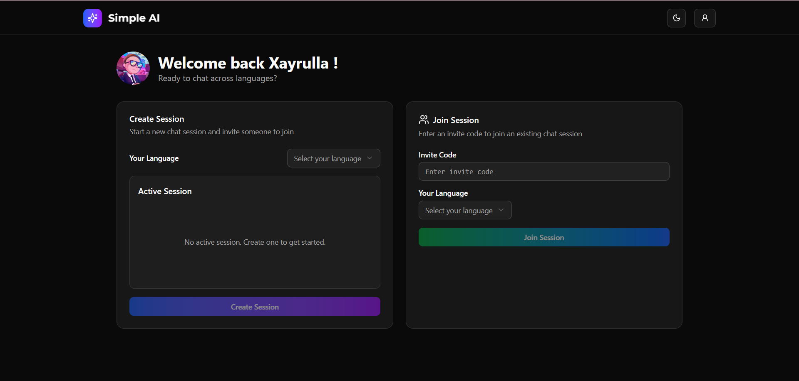

## Simple AI

**Simple AI** is a real-time voice and text chat app with **automatic language translation** — powered by **Gemini AI**.

Effortlessly start chat sessions using invite codes and communicate across languages.

---

### Live Demo

<a href="https://talkbridge.uz" target="_blank" rel="noopener noreferrer">talkbridge.uz</a>

### Tech Stack

- **Gemini AI** – for language translation  
- **React + Vite + TypeScript** – fast, modern frontend  
- **shadcn/ui** – elegant, accessible UI components  

---

### Features

- Real-time **voice & text chat**
- **Auto-translation** between languages
- **Invite-based sessions** – join instantly with a code
- Clean, responsive UI with **shadcn/ui**

---

### 📸 Preview

